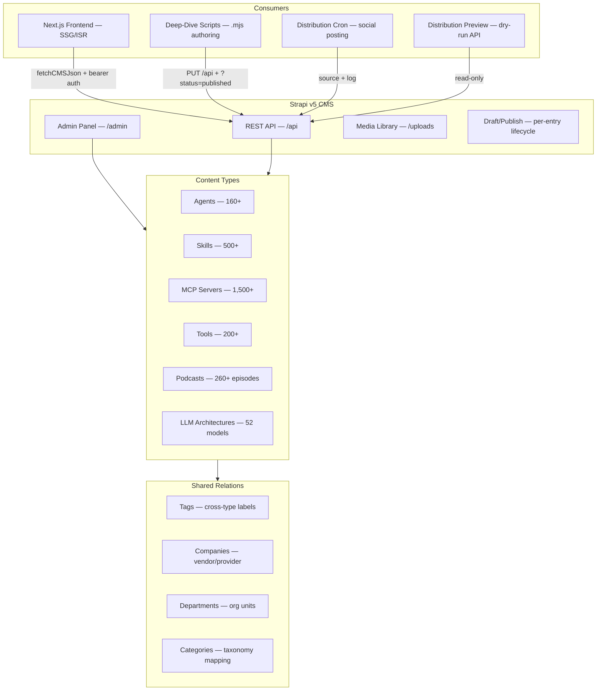
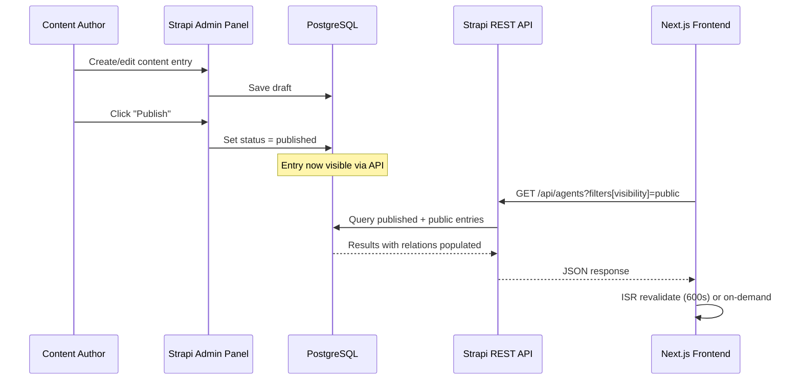

# Colaberry AI CMS

<p align="center">
  <strong>Strapi v5 headless CMS powering colaberry.ai. 6 content types. 2,500+ entries. Zero frontend coupling.</strong><br>
  The content backbone for enterprise AI catalog, podcast transcripts, and LLM architecture deep dives.
</p>

<p align="center">
  <a href="https://colaberry.ai">
    
  </a>
  
  
  
  
  
</p>

---

## What It Does

This is the **headless CMS** for the [Colaberry AI](https://github.com/colaberry/colaberry-ai) platform. It manages all structured content — agents, skills, MCP servers, tools, podcasts, and LLM architectures — and serves them via REST API to the Next.js frontend.

The CMS handles:
- **Content authoring** for 6 primary catalog types
- **Draft/publish workflow** (Strapi v5 draft system)
- **Media management** for cover images, audio files, and transcripts
- **Global navigation** configuration consumed by the frontend header/footer
- **Distribution channel** configuration for automated social posting
- **Taxonomy relations** (tags, companies, departments, categories)

---

## Architecture



### Data Flow



---

## Content Types

### Primary Catalog Types

| Content Type | API Endpoint | Key Fields | Entries |
|-------------|-------------|------------|---------|
| **Agent** | `/api/agents` | name, slug, description, longDescription, keyBenefits, useCases, limitations, whatItDoes, outcomes, coreTasks, inputs, outputs, tools, executionModes, orchestration, securityCompliance, industry, status, visibility, rating, source, verified | 160+ |
| **Skill** | `/api/skills` | name, slug, category, skillType, description, provider, prerequisites, linkedMCP, visibility | 500+ |
| **MCP Server** | `/api/mcp-servers` | name, slug, description, serverType, primaryFunction, capabilities, authentication, hostingOptions, visibility | 1,500+ |
| **Tool** | `/api/tools` | name, slug, toolCategory, description, webLink, pricing, visibility | 200+ |
| **Podcast Episode** | `/api/podcast-episodes` | title, slug, publishedDate, transcript, transcriptSegments, audioUrl, buzzsproutId, podcastStatus, tags, companies | 260+ |
| **LLM Architecture** | `/api/llm-architectures` | name, slug, organization, parameters, activeParameters, contextWindow, vocabSize, numLayers, hiddenSize, releaseDate, decoderType, attention, keyFeatures, deepDive (Dynamic Zone) | 52 |

### Supporting Types

| Content Type | Purpose |
|-------------|---------|
| **Tag** | Cross-type labels (many-to-many) |
| **Company** | Vendor/provider references |
| **Department** | Organizational units with category nesting |
| **Category** | Taxonomy parent grouping |
| **Global Navigation** | CMS-driven header/footer link structure |
| **Distribution Channel** | Social platform config (name, platform, template, credentials ref) |
| **Distribution Log** | Per-dispatch audit trail (platform, entry ID, status, response) |

### Dynamic Zone: Deep Dive Blocks

LLM Architecture entries include a `deepDive` Dynamic Zone with these components:

| Component | Fields | Purpose |
|-----------|--------|---------|
| `deep.heading` | level (h2/h3/h4), text, anchor | Section headings |
| `deep.paragraph` | body (rich text) | Prose content |
| `deep.callout` | variant (insight/warning/note), title, body | Highlighted blocks |
| `deep.code-block` | language, code, caption | Code examples |
| `deep.table` | caption, headers[], rows[][] | Data tables |
| `deep.list` | style (bullet/numbered), items[] | Lists |
| `deep.image` | url, alt, caption | Figures |
| `deep.references` | items[] (title, url, authors, year) | Citations |

---

## Quick Start

### Prerequisites

- Node.js 20+
- PostgreSQL 16+ (or use Docker)

### Local Development

```bash
git clone https://github.com/colaberry/colaberry-ai-cms.git
cd colaberry-ai-cms
npm install
cp .env.example .env   # Configure DATABASE_URL and secrets
npm run develop
```

Open [http://localhost:1337/admin](http://localhost:1337/admin) to access the admin panel.

### Docker

```bash
docker compose up
```

### Environment Variables

| Variable | Required | Description |
|----------|----------|-------------|
| `DATABASE_URL` | Yes | PostgreSQL connection string |
| `APP_KEYS` | Yes | Strapi app keys (comma-separated) |
| `API_TOKEN_SALT` | Yes | Salt for API token hashing |
| `ADMIN_JWT_SECRET` | Yes | JWT secret for admin panel |
| `JWT_SECRET` | Yes | JWT secret for API auth |
| `TRANSFER_TOKEN_SALT` | Yes | Salt for transfer tokens |

### Build

```bash
npm run build    # Build admin panel
npm run start    # Start production server
```

---

## API Usage

### Authentication

All API requests from the frontend use a bearer token:

```bash
curl -H "Authorization: Bearer <CMS_API_TOKEN>" \
  "http://localhost:1337/api/agents?filters[visibility]=public&populate=*"
```

### Common Query Patterns

```bash
# List all published agents (public visibility)
GET /api/agents?filters[visibility]=public&populate=tags,companies,department,coverImage

# Single agent by slug
GET /api/agents?filters[slug]=crop-stress-detection&populate=*

# Paginated skills with category filter
GET /api/skills?filters[visibility]=public&filters[category]=AI&pagination[page]=1&pagination[pageSize]=25

# Podcast episodes with audio
GET /api/podcast-episodes?filters[podcastStatus]=published&populate=tags,companies&sort=publishedDate:desc

# LLM architecture with deep dive blocks
GET /api/llm-architectures?filters[slug]=deepseek-v3&populate[deepDive][populate]=*

# Catalog counts (lightweight)
GET /api/agents?filters[visibility]=public&pagination[pageSize]=1&pagination[withCount]=true
GET /api/skills?filters[visibility]=public&pagination[pageSize]=1&pagination[withCount]=true
GET /api/mcp-servers?filters[visibility]=public&pagination[pageSize]=1&pagination[withCount]=true

# All tags with usage counts
GET /api/tags?populate=agents,skills,mcp_servers&pagination[pageSize]=100
```

### Deep Dive Authoring (Script -> CMS)

The `author-llm-deep-dive.mjs` script PUTs dynamic zone blocks directly:

```bash
# Publish a deep dive (appends ?status=published for Strapi v5 draft system)
node scripts/author-llm-deep-dive.mjs --slug deepseek-v3

# Dry run
node scripts/author-llm-deep-dive.mjs --slug deepseek-v3 --dry-run

# Publish all 52 flagships
node scripts/author-llm-deep-dive.mjs --all
```

**Critical:** The `?status=published` query param is required. Without it, Strapi v5 defaults PUT requests to draft status and SSR never sees the content.

---

## Distribution System

The CMS stores distribution channel configuration and dispatch logs.

### Distribution Channel (CMS Collection)

| Field | Type | Description |
|-------|------|-------------|
| `name` | String | Channel display name (e.g. "X/Twitter Main") |
| `platform` | Enum | `x`, `moltbook`, `huggingface`, etc. |
| `template` | Text | Mustache-style post template |
| `credentialRef` | String | Env var name (CMS never holds secrets) |
| `active` | Boolean | Enable/disable channel |

### Distribution Log (CMS Collection)

| Field | Type | Description |
|-------|------|-------------|
| `platform` | String | Target platform |
| `entryId` | String | Source content entry ID |
| `entryType` | String | Content type (agent, skill, etc.) |
| `status` | Enum | `success`, `failed`, `skipped`, `dry-run` |
| `response` | JSON | Platform API response |
| `idempotencyKey` | String | `${platform}:${id}:${updatedAt}` |

### Seeding Channels

```bash
# Idempotent — re-running updates existing rows by name
node scripts/seed-distribution-channels.mjs
```

Templates live in `scripts/distribution-templates/{x,moltbook,huggingface}.md`.

---

## Deployment

### GCP Cloud Run

| Service | Description |
|---------|-------------|
| `colaberry-ai-cms-prod` | Production CMS instance |

The CMS runs as a stateless container on Cloud Run with a managed PostgreSQL backend.

### Important Notes

- **Media storage:** Configure a cloud storage provider (GCS, S3) for production media uploads
- **API tokens:** Generate via Strapi admin panel → Settings → API Tokens
- **Draft/Publish:** All content types use Strapi v5's built-in draft/publish system. Only published entries are visible via the API with default filters
- **ISR sync:** The frontend uses ISR with 600s revalidation. Content changes appear on the live site within 10 minutes of publishing

---

## Project Structure

```
colaberry-ai-cms/
├── config/
│   ├── api.js           # API configuration
│   ├── admin.js         # Admin panel configuration
│   ├── database.js      # Database connection (PostgreSQL)
│   ├── middlewares.js   # CORS, security, body parser
│   ├── plugins.js       # Plugin configuration
│   └── server.js        # Server host/port settings
├── src/
│   ├── api/             # Content type definitions
│   │   ├── agent/       # Schema, controllers, routes, services
│   │   ├── skill/
│   │   ├── mcp-server/
│   │   ├── tool/
│   │   ├── podcast-episode/
│   │   ├── llm-architecture/
│   │   ├── tag/
│   │   ├── company/
│   │   ├── department/
│   │   ├── category/
│   │   ├── global-navigation/
│   │   ├── distribution-channel/
│   │   └── distribution-log/
│   ├── components/      # Reusable Dynamic Zone components
│   │   └── deep/        # Deep dive block types (heading, paragraph, etc.)
│   └── extensions/      # Strapi lifecycle hooks
├── public/              # Static assets
├── database/            # Migrations
└── types/               # Generated TypeScript types
```

---

## Related Repositories

| Repository | Purpose |
|-----------|---------|
| [colaberry/colaberry-ai](https://github.com/colaberry/colaberry-ai) | Next.js frontend (consumer of this CMS) |
| [colaberry/WorldOfTaxonomy](https://github.com/colaberry/WorldOfTaxonomy) | Taxonomy classification platform |

---

<p align="center">
  <strong>Colaberry AI CMS</strong> — Structured content for the enterprise AI catalog.
</p>
